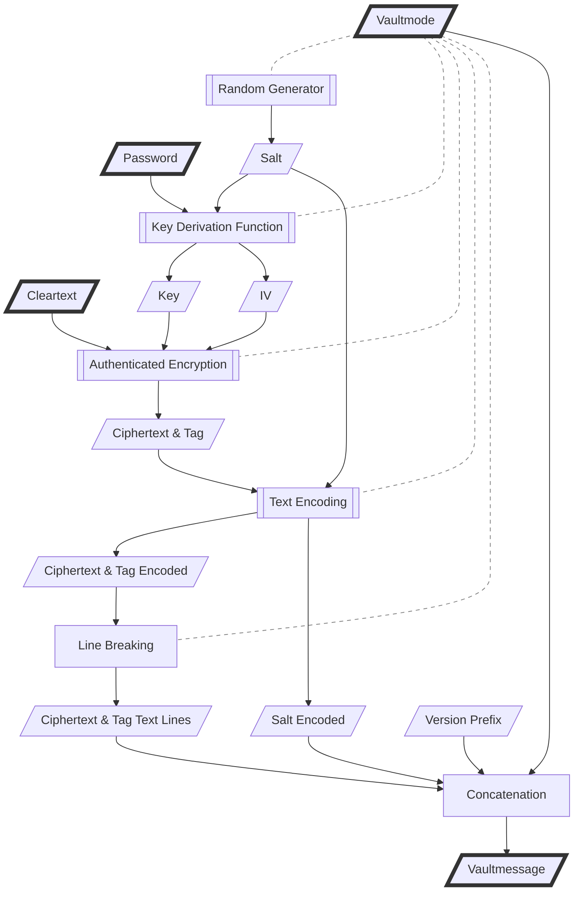

# situ-vault

## Encryption

```mermaid
graph TB

    %% user inputs:
    pw[/Password/]
    cleartext[/Cleartext/]
    mode[/Vaultmode/]

    style pw stroke:#333,stroke-width:5px
    style cleartext stroke:#333,stroke-width:5px
    style mode stroke:#333,stroke-width:5px
    
    mode -.- rnd
    mode -.- kdf
    mode -.- ae
    mode -.- encode
    mode -.- lb
    
    %% mode influences subprocesses: (link styling not for ids)
    linkStyle 0 stroke:#808080,stroke-width:1px,stroke-dasharray: 5 5
    linkStyle 1 stroke:#808080,stroke-width:1px,stroke-dasharray: 5 5
    linkStyle 2 stroke:#808080,stroke-width:1px,stroke-dasharray: 5 5
    linkStyle 3 stroke:#808080,stroke-width:1px,stroke-dasharray: 5 5
    linkStyle 4 stroke:#808080,stroke-width:1px,stroke-dasharray: 5 5
    
    %% key derivation:
    rnd[[Random Generator]]
    salt[/Salt/]
    rnd --> salt
    kdf[[Key Derivation Function]]
    pw --> kdf
    salt --> kdf
    key[/Key/]
    iv[/IV/]
    kdf --> key
    kdf --> iv
    
    %% encryption:
    ae[[Authenticated Encryption]]
    key --> ae
    iv --> ae
    cleartext-->ae
    ae --> ciphertext
    ciphertext[/Ciphertext & Tag/]
    
    %% encoding:
    encode[[Text Encoding]]
    salt --> encode
    ciphertext --> encode
    encode --> ciphertextEnc
    encode --> saltEnc
    ciphertextEnc[/Ciphertext & Tag Encoded/]
    saltEnc[/Salt Encoded/]
    
    %% line wrap:
    lb[Line Breaking]
    ciphertextWrapped[/Ciphertext & Tag Text Lines/]
    ciphertextEnc --> lb
    lb --> ciphertextWrapped
    
    %% concat message:
    version[/Version Prefix/]
    concat[Concatenation]
    message[/Vaultmessage/]
    style message stroke:#333,stroke-width:5px

    version --> concat
    mode --> concat
    saltEnc --> concat
    ciphertextWrapped --> concat

    concat --> message

```
